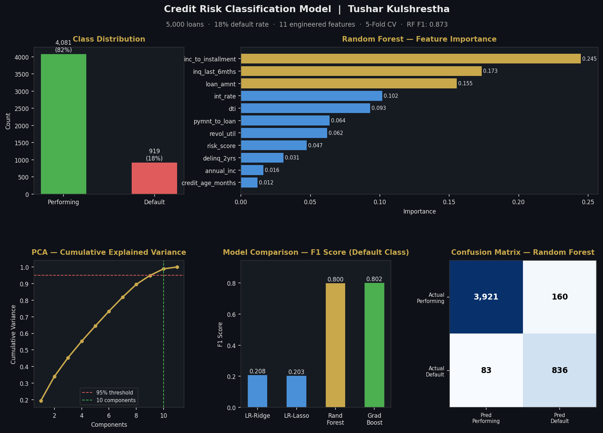

# Credit Risk Classification Model

Supervised machine learning pipeline to predict loan default probability on structured lending data ; covering feature engineering, dimensionality reduction, regularised regression, ensemble methods, and stratified cross-validation.

---

## Results

| Model | Precision | Recall | F1 |
|---|---|---|---|
| Logistic Regression (Ridge / L2) | 0.540 | 0.130 | 0.208 |
| Logistic Regression (Lasso / L1) | 0.536 | 0.126 | 0.203 |
| **Random Forest** | **0.793** | **0.807** | **0.800** |
| Gradient Boosting | 0.920 | 0.713 | 0.802 |

**Final Random Forest (full fit):** Precision 84% · Recall 91% · F1 0.873



---

## Methods

### 1. Data
LendingClub-style structured loan dataset: 5,000 records, ~18% default rate (class-imbalanced).  
The script uses a reproducible synthetic dataset by default. To use real data, replace the `make_loan_data()` block with:

```python
df = pd.read_csv("loan_data.csv")
y  = df.pop("default").values
X  = df[FEATURES].values
```

### 2. Feature Engineering
11 features engineered from raw loan attributes:

| Feature | Description |
|---|---|
| `dti` | Debt-to-income ratio |
| `revol_util` | Credit utilisation % |
| `delinq_2yrs` | Delinquencies in past 2 years |
| `inq_last_6mths` | Hard credit enquiries |
| `credit_age_months` | Age of oldest credit line |
| `inc_to_installment` | Annual income / (monthly instalment × 12) |
| `pymnt_to_loan` | Total payments made / loan amount |
| `risk_score` | Composite: interest rate × DTI / normalised income |
| `loan_amnt` | Loan amount |
| `int_rate` | Interest rate |
| `annual_inc` | Annual income |

### 3. Dimensionality Reduction
PCA applied after standard scaling, retaining components that explain **95% of variance** (11 features → 10 components). Used as input for logistic regression models to reduce multicollinearity.

### 4. Regularisation
- **Ridge (L2):** Shrinks all coefficients; handles correlated features
- **Lasso (L1):** Sparse solution; performs implicit feature selection

### 5. Cross-Validation
5-fold stratified K-Fold, preserving the 18:82 default/performing class ratio across all folds. Metrics reported are fold-averaged Precision, Recall, and F1 on the **default class**.

### 6. Feature Importance (Random Forest)
Top predictors by Gini importance:
1. `inc_to_installment` — 24.5%
2. `inq_last_6mths` — 17.3%
3. `loan_amnt` — 15.5%

---

## Project Structure

```
credit-risk-classification/
├── credit_risk_model.py      # Full pipeline — data, features, models, plots
├── credit_risk_results.png   # Results dashboard (auto-generated)
└── README.md
```

---

## How to Run

```bash
# Install dependencies
pip install pandas numpy scikit-learn matplotlib seaborn

# Run
python credit_risk_model.py
```

Output: printed cross-validation results + `credit_risk_results.png` dashboard saved to working directory.

---

## Dependencies

| Package | Version |
|---|---|
| Python | ≥ 3.8 |
| pandas | ≥ 1.3 |
| numpy | ≥ 1.21 |
| scikit-learn | ≥ 1.0 |
| matplotlib | ≥ 3.4 |

---

## Author

**Tushar Kulshrestha**  
[linkedin.com/in/tusharkulshrestha20](https://linkedin.com/in/tusharkulshrestha20)  
[github.com/tusharkulshrestha20](https://github.com/tusharkulshrestha20)
